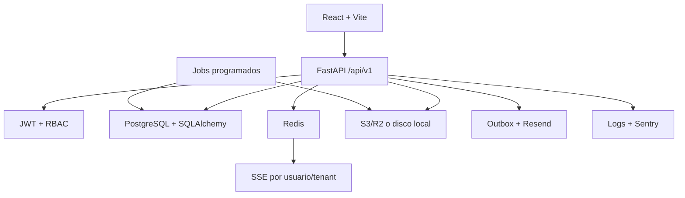

# SimuCenter OS — arquitectura actual

**Corte analizado:** paquete recibido el 19-09-2026.  
**Método:** análisis estático de código y configuración; no se modificó el proyecto ni se aplicaron migraciones.  
**Confianza:** `[Seguro]` cuando se verificó en código, `[Probable]` cuando depende del despliegue, `[No verificado]` cuando exige ejecutar infraestructura.

## Conclusión ejecutiva

SimuCenter OS es un **monolito SaaS multi-tenant por capas**, desplegable en contenedores. El frontend React consume una API FastAPI; PostgreSQL contiene datos de negocio, Redis soporta eventos SSE, rate limiting y revocación de refresh tokens, y el almacenamiento es local o S3 compatible. La aplicación tiene una superficie funcional grande: 45 routers, 480 decoradores de operación HTTP, 43 archivos de modelos, 102 archivos de pruebas backend, 229 páginas TSX y 162 revisiones Alembic.

La base es rescatable, pero no es todavía el monolito modular objetivo. Los dominios están repartidos horizontalmente entre `models/`, `schemas/`, `routers/` y `services/`; numerosos routers concentran validación, autorización, consultas y orquestación. El tamaño de archivos como `solicitud_simulacion.py` (1.070 líneas), `evaluacion.py` (1.028) y `escenario_clinico.py` (995) confirma el acoplamiento.

## Componentes verificados

| Área | Implementación actual | Evidencia principal |
|---|---|---|
| Backend | FastAPI 0.136.1, Python 3.12, SQLAlchemy síncrono 2.0 | `backend/requirements.txt`, `app/main.py` |
| Frontend | React 19, TypeScript 6, Vite 8, React Query, Zustand | `frontend/package.json` |
| Datos | PostgreSQL 16 en desarrollo/CI, Alembic | `docker-compose.yml`, `.github/workflows/ci.yml` |
| Auth | Bearer JWT HS256, access 30 min, refresh 7 días | `core/security.py`, `routers/auth.py` |
| Autorización | Roles múltiples y permisos `recurso.acción` | `core/permissions.py`, `dependencies/auth.py` |
| Tenant | `tenant_id`, filtro ORM automático y guard de escritura | `core/tenant_scope.py` |
| Tiempo real | SSE y Redis pub/sub | `routers/sse.py`, `core/events.py` |
| Archivos | Adaptador local/S3, cuotas, validación MIME | `services/storage.py`, `file_service.py`, `upload_validation.py` |
| Correo | Transactional outbox y job de drenaje | `models/email_outbox.py`, `jobs/send_pending_emails.py` |
| Observabilidad | JSON logs, request ID, Sentry opcional | `core/observability.py` |
| CI | lint, tipos, pruebas, Bandit, pip-audit, migraciones, Gitleaks, Trivy | `.github/workflows/ci.yml` |

## Flujo típico real

`HTTP → router FastAPI → dependencia de autenticación/permisos → consulta o servicio → SQLAlchemy Session → PostgreSQL`.

No existe una frontera uniforme de repositorios o casos de uso. Algunos dominios delegan en servicios; otros implementan la lógica directamente en el router. Esto impide asegurar invariantes de manera uniforme y complica pruebas unitarias aisladas.

## Multi-tenancy actual

El usuario se carga desde PostgreSQL y el `tenant_id` autoritativo se toma de ese registro, no del claim JWT. Luego `tenant_scope()` instala filtros `with_loader_criteria` para SELECT y un listener `before_flush` impide persistir objetos ORM con un tenant distinto.

Fortalezas:

- evita confiar en un `tenant_id` manipulable del token;
- cubre modelos legacy que poseen la columna aunque no hereden `TenantMixin`;
- incluye tests específicos de aislamiento;
- usa FKs compuestas e índices tenant en varias áreas.

Límite crítico: **no existe PostgreSQL RLS** en el repositorio. El scope ORM no protege SQL directo, operaciones Core/bulk, conexiones fuera de sesión, jobs o scripts que olviden filtrar. La base de datos aún no es una barrera independiente.

## Decisión para SimuCenter Next

No migrar el código archivo por archivo. Conservar reglas, pruebas, nomenclatura útil y contratos; reimplementar por dominios dentro de un monolito modular. El sistema actual debe permanecer como referencia ejecutable hasta completar equivalencia funcional.

