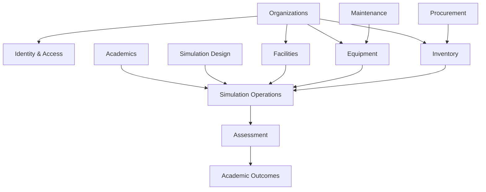

# Inventario de dominios

## Mapa funcional observado

| Dominio objetivo | Capacidades encontradas | Estado recomendado |
|---|---|---|
| Identity & Access | login, activación, reset, refresh/logout, usuarios, roles múltiples, permisos, impersonación | REDESIGN estructural; KEEP de reglas |
| Organizations | tenants, plan, cuotas, vigencia, configuración institucional y facturación | KEEP + REDESIGN de entitlements |
| Facilities | campus, edificios, salas, estados y actividad | KEEP |
| Equipment | marcas, modelos, protocolos, accesorios, equipos, cronogramas | KEEP; primer vertical slice recomendado |
| Supplies/Inventory | insumos, estanterías, ingresos, egresos, ajustes, kardex y reportes | KEEP; separar inventario de catálogo |
| Maintenance | tickets y bitácoras de equipos e infraestructura, contratos | KEEP; unificar patrones duplicados |
| Procurement | proveedores, solicitudes, proformas, órdenes, subórdenes y backorders | KEEP; aislar visibilidad de costos |
| Simulation Design | escenarios clínicos, estados, paciente, recursos y configuración ECS | KEEP + REDESIGN de agregado |
| Simulation Operations | solicitudes, agenda, preparación, sesiones, actividades, tandas y cobertura | KEEP + REDESIGN prioritario |
| Academics | programas, periodos, asignaturas, grupos, cursos y matrículas | KEEP; depurar conceptos solapados |
| Assessment | competencias, instrumentos/versiones, evaluaciones, resultados y outcomes | KEEP + REDESIGN prioritario |
| Student Portal | simulaciones, preparación, evaluaciones, competencias e historial | KEEP |
| Documents | file assets, subida/confirmación/descarga/purga y cuotas | KEEP como capacidad transversal |
| Notifications | outbox de correo, push opcional, SSE | KEEP, convertir a consumidores de eventos |
| Audit | audit log tenant, superadmin audit y eventos de matrícula/roles | KEEP; reforzar inmutabilidad |
| Reporting/Analytics | gastos, inventario, compras, outcomes y métricas superadmin | KEEP datos; REDESIGN modelo analítico |

## Fronteras que hoy están borrosas

1. `solicitudes`, `agendamientos`, `preparaciones`, `sesiones`, `actividades` y `tandas` comparten el ciclo operativo, pero las invariantes se distribuyen entre routers y servicios.
2. `curso` convive con `programa/periodo/asignatura/grupo`; hay que decidir si curso es cohorte, oferta, grupo o concepto legacy.
3. Mantenimiento de equipo e infraestructura repite patrones de tickets/bitácoras. Debe compartir un kernel de workflow sin fusionar sus reglas específicas.
4. Archivos, auditoría, notificaciones y permisos son capacidades de plataforma; no deben pertenecer a un único módulo de negocio.
5. El catálogo de permisos mezcla capacidad y alcance (`ver_todas`, `dashboard`). Next debe modelar acción y scope explícitamente.

## Context map propuesto

## Orden recomendado de extracción conceptual

1. Organizations + IAM + tenancy.
2. Equipment como patrón transversal.
3. Facilities e Inventory.
4. Maintenance y Procurement.
5. Academics.
6. Simulation Design y Operations.
7. Assessment, Portal y Analytics.

